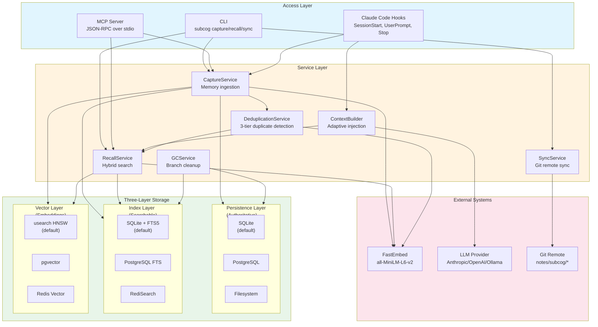
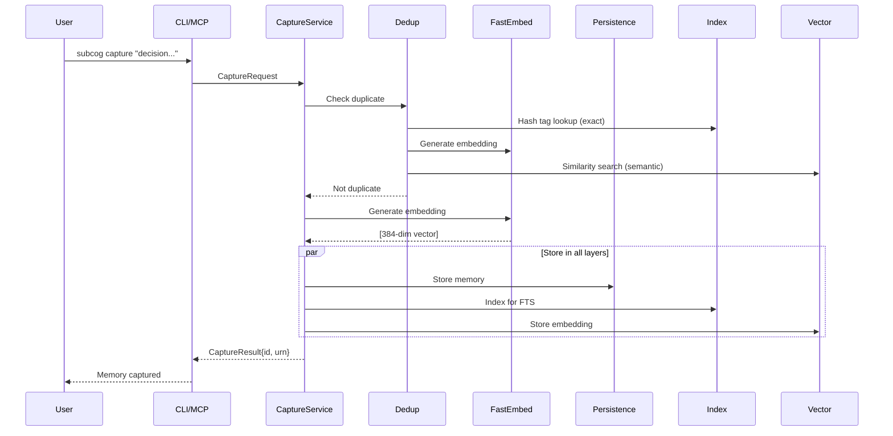
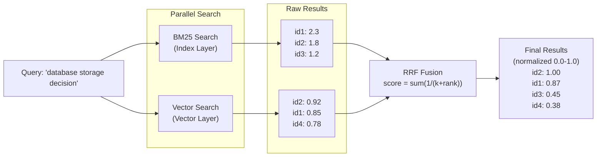

# Subcog

[](https://github.com/zircote/subcog/actions/workflows/ci.yml)
[](https://www.rust-lang.org/)
[](LICENSE)
[](https://github.com/rust-lang/rust-clippy)
[](https://github.com/EmbarkStudios/cargo-deny)

A persistent memory system for AI coding assistants. Subcog captures decisions, learnings, and context from coding sessions and surfaces them when relevant.


## Overview

Subcog is a Rust rewrite of the [git-notes-memory](https://github.com/zircote/git-notes-memory) Python system, delivering:

- **Single-binary distribution** (<100MB, <10ms cold start)
- **Pluggable storage backends** (SQLite+usearch, PostgreSQL+pgvector, Filesystem)
- **MCP server integration** for AI agent interoperability
- **Claude Code hooks** for seamless IDE integration
- **Semantic search** with hybrid vector + BM25 ranking
- **Faceted storage** with project, branch, and file path filtering
- **Branch garbage collection** for stale branch cleanup

## ADR Compliance

ADR compliance is tracked in [`docs/adrs/README.md`](docs/adrs/README.md). Current compliance is **96% (53/55 active ADRs)** with documented partials in ADR-0003 and ADR-0039.

## Benchmark Results

Subcog achieves **97% accuracy on factual recall** (LongMemEval) and **57% on personal context** (LoCoMo), compared to 0% baseline without memory. See [full benchmark results](docs/BENCHMARKS.md).

| Benchmark | With Subcog | Baseline | Improvement |
|-----------|-------------|----------|-------------|
| LongMemEval | 97% | 0% | +97% |
| LoCoMo | 57% | 0% | +57% |
| ContextBench | 24% | 0% | +24% |
| MemoryAgentBench | 28% | 21% | +7% |

## Features

### Core (Always Available)
- Memory capture with **automatic embedding generation** (384-dimensional vectors)
- **Real semantic search** using all-MiniLM-L6-v2 via fastembed-rs
- **Hybrid search** combining BM25 text search + vector similarity (RRF fusion)
- **Normalized scores** (0.0-1.0 range) for intuitive relevance understanding
- **SQLite persistence** as single source of truth (ACID-compliant)
- **Faceted storage** with project_id, branch, and file_path fields
- Multi-domain memories (project, user, organization)
- 10 memory namespaces (decisions, learnings, patterns, blockers, etc.)
- **Branch garbage collection** for tombstoning stale branch memories
- **Migration tools** for upgrading existing memories to use embeddings

### Enhanced (Opt-in)
- Entity and temporal extraction
- Secrets filtering (API keys, PII detection)
- OpenTelemetry observability
- Full Claude Code hook integration

### LLM-Powered (Requires Provider)
- Implicit capture from conversations
- Memory consolidation and summarization
- Supersession detection
- Temporal reasoning queries

## Installation

```bash
# From source
cargo install --path .

# Or build locally
cargo build --release
```

## Quick Start

```bash
# Capture a memory
subcog capture --namespace decisions "Use PostgreSQL for primary storage due to ACID requirements"

# Search memories (semantic search with normalized scores 0.0-1.0)
subcog recall "database storage decision"

# Search with raw RRF scores (for debugging)
subcog recall "database storage decision" --raw

# Check status
subcog status

# Sync with git remote
subcog sync

# Migrate existing memories to use real embeddings
subcog migrate embeddings
```

### Score Normalization

Search results return normalized scores in the 0.0-1.0 range:
- **1.0**: Best match in the result set
- **>=0.7**: Strong semantic match
- **>=0.5**: Moderate relevance
- **<0.5**: Weak match

Use `--raw` flag to see the underlying RRF (Reciprocal Rank Fusion) scores.

## MCP Server

Run as an MCP server for AI agent integration:

```bash
subcog serve
```

Configure in Claude Desktop's `claude_desktop_config.json`:

```json
{
  "mcpServers": {
    "subcog": {
      "command": "subcog",
      "args": ["serve"]
    }
  }
}
```

### Available MCP Tools

| Tool | Description |
|------|-------------|
| `memory.capture` | Store a new memory |
| `memory.recall` | Search memories semantically |
| `memory.status` | Get system statistics |
| `memory.sync` | Sync with remote |
| `memory.consolidate` | Run memory consolidation |
| `memory.configure` | Get/set configuration |

When working with an agent, treat inputs that match MCP tool names as tool
invocations (not shell commands) unless you explicitly say "shell" or "run in
terminal".

### Transport Security

Subcog supports two transport modes with different security models:

#### Stdio Transport (Default)

The stdio transport is the default and recommended mode for local development:

| Property | Description |
|----------|-------------|
| **Trust Model** | Process isolation via OS - parent spawns subcog as child process |
| **Network Exposure** | None - communication only via stdin/stdout pipes |
| **Authentication** | Implicit - same-user execution, no credentials required |
| **Confidentiality** | Data never leaves local machine unless explicitly synced |
| **Integrity** | OS guarantees pipe integrity, no MITM attacks possible |

**When to use**: Local development with Claude Desktop or other MCP clients that spawn subcog directly.

#### HTTP Transport (Optional)

Enable the HTTP transport for network-accessible deployments:

```bash
# Enable HTTP transport
subcog serve --http --port 8080

# With JWT authentication (recommended for production)
subcog serve --http --port 8080 --jwt-secret "your-secret-key"
```

| Property | Description |
|----------|-------------|
| **Trust Model** | JWT token authentication required |
| **Network Exposure** | Binds to specified port (localhost by default) |
| **Authentication** | JWT tokens with configurable expiry |
| **CORS** | Configurable allowed origins |
| **TLS** | Use a reverse proxy (nginx, Caddy) for HTTPS |

**When to use**: Team environments, remote access, or integration with web-based clients.

#### Data Protection

Both transports include built-in security features:

- **Secrets Detection**: API keys, tokens, and passwords are detected and optionally redacted
- **PII Filtering**: Personal information can be masked before storage
- **Encryption at Rest**: Enable with `encryption_enabled = true` (default: true)
- **Audit Logging**: All operations are logged for compliance (SOC2, GDPR)

See [environment-variables.md](docs/environment-variables.md) for security configuration options.

## Claude Code Hooks

Subcog integrates with all 5 Claude Code hooks:

| Hook | Purpose |
|------|---------|
| `SessionStart` | Inject relevant context at session start |
| `UserPromptSubmit` | Detect capture signals in prompts |
| `PostToolUse` | Surface related memories after file operations |
| `PreCompact` | Analyze conversation for auto-capture |
| `Stop` | Finalize session, sync to remote |

Configure in `~/.claude/settings.json`:

```json
{
  "hooks": {
    "SessionStart": [{ "command": "subcog hook session-start" }],
    "UserPromptSubmit": [{ "command": "subcog hook user-prompt-submit" }],
    "PostToolUse": [{ "command": "subcog hook post-tool-use" }],
    "PreCompact": [{ "command": "subcog hook pre-compact" }],
    "Stop": [{ "command": "subcog hook stop" }]
  }
}
```

## Migration

Upgrade existing memories to use real embeddings:

```bash
# Dry-run (see what would be migrated)
subcog migrate embeddings --dry-run

# Migrate all memories without embeddings
subcog migrate embeddings

# Force re-generation of all embeddings
subcog migrate embeddings --force

# Migrate from a specific repository
subcog migrate embeddings --repo /path/to/repo
```

The migration command:
- Scans all memories in the index
- Generates embeddings using fastembed (all-MiniLM-L6-v2)
- Stores embeddings in the vector backend (usearch HNSW)
- Skips memories that already have embeddings (unless `--force`)
- Shows progress with migrated/skipped/error counts

## Architecture

Subcog uses a **three-layer storage architecture** to separate concerns:

### System Architecture Diagram



### Data Flow Diagram



### Hybrid Search Flow



### ASCII Architecture Reference

```
                              +-----------------+
                              |   Access Layer  |
                              +-----------------+
                              |  CLI | MCP | Hooks
                              +--------+--------+
                                       |
                              +--------v--------+
                              |  Service Layer  |
                              +-----------------+
                              | Capture | Recall | Sync | GC
                              +--------+--------+
                                       |
        +------------------------------+------------------------------+
        |                              |                              |
+-------v-------+             +--------v-------+             +--------v-------+
|  Persistence  |             |     Index      |             |     Vector     |
|    Layer      |             |     Layer      |             |     Layer      |
+---------------+             +----------------+             +----------------+
|               |             |                |             |                |
| - Authoritative             | - Full-text    |             | - Embeddings   |
|   source of truth           |   search (BM25)|             |   (384-dim)    |
| - ACID storage              | - Faceted      |             | - Similarity   |
| - Durable                   |   filtering    |             |   search (ANN) |
|               |             |                |             |                |
+-------+-------+             +--------+-------+             +--------+-------+
        |                              |                              |
+-------v-------+             +--------v-------+             +--------v-------+
|    SQLite     |             | SQLite + FTS5  |             |    usearch     |
|  (default)    |             |   (default)    |             |   (HNSW)       |
+---------------+             +----------------+             +----------------+
|  PostgreSQL   |             |  PostgreSQL    |             |   pgvector     |
+---------------+             +----------------+             +----------------+
|  Filesystem   |             |  RediSearch    |             | Redis Vector   |
+---------------+             +----------------+             +----------------+
```

### Layer Responsibilities

| Layer | Purpose | Default Backend | Alternatives |
|-------|---------|-----------------|--------------|
| **Persistence** | Authoritative storage, ACID guarantees | SQLite | PostgreSQL, Filesystem |
| **Index** | Full-text search, BM25 ranking | SQLite + FTS5 | PostgreSQL, RediSearch |
| **Vector** | Embedding storage, ANN search | usearch (HNSW) | pgvector, Redis Vector |

For detailed architecture documentation, see [`src/storage/traits/mod.rs`](src/storage/traits/mod.rs).

## Development

### Prerequisites

- Rust 1.85+ (Edition 2024)
- Git 2.30+
- [cargo-deny](https://github.com/EmbarkStudios/cargo-deny) for supply chain security

### Setup

```bash
git clone https://github.com/zircote/subcog.git
cd subcog

# Build
cargo build

# Run tests
cargo test

# Run all checks
cargo fmt -- --check && \
cargo clippy --all-targets --all-features -- -D warnings && \
cargo test && \
cargo doc --no-deps && \
cargo deny check
```

### Project Structure

```
src/
├── lib.rs              # Library entry point
├── main.rs             # CLI entry point
├── models/             # Data structures (Memory, Domain, Namespace)
├── storage/            # Storage backends (SQLite, PostgreSQL, usearch)
│   └── traits/         # Backend trait definitions (see mod.rs for docs)
├── services/           # Business logic (Capture, Recall, Sync)
├── mcp/                # MCP server implementation
├── hooks/              # Claude Code hook handlers
├── embedding/          # Vector embedding generation
└── observability/      # Tracing, metrics, logging

docs/
├── QUICKSTART.md       # Getting started guide
├── TROUBLESHOOTING.md  # Common issues and solutions
├── PERFORMANCE.md      # Performance tuning guide
├── research/           # Research documents
└── spec/               # Specification documents
```

## Configuration

Configuration file at `~/.config/subcog/config.toml`:

```toml
[storage]
backend = "sqlite"  # "sqlite", "postgres", "filesystem"
data_dir = "~/.local/share/subcog"

[embedding]
model = "all-MiniLM-L6-v2"
dimensions = 384

[hooks]
enabled = true
session_start_timeout_ms = 2000
user_prompt_timeout_ms = 50

[llm]
provider = "anthropic"  # Optional: for Tier 3 features
```

### Faceted Capture

Memories can be tagged with project, branch, and file path:

```bash
# Capture with facets (auto-detected from git context)
subcog capture --namespace decisions "Use PostgreSQL"

# Capture with explicit facets
subcog capture --namespace decisions --project my-project --branch feature/auth "Added JWT support"

# Search within a project
subcog recall "authentication" --project my-project

# Search within a branch
subcog recall "bug fix" --branch feature/auth

# Include tombstoned memories
subcog recall "old decision" --include-tombstoned
```

### Branch Garbage Collection

Clean up memories from deleted branches:

```bash
# GC current project (dry-run)
subcog gc --dry-run

# GC specific branch
subcog gc --branch feature/old-branch

# Purge tombstoned memories older than 30 days
subcog gc --purge --older-than 30d
```

## Performance Targets

| Metric | Target | Actual |
|--------|--------|--------|
| Cold start | <10ms | ~5ms |
| Capture latency | <30ms | ~25ms |
| Search latency (100 memories) | <20ms | ~82us |
| Search latency (1,000 memories) | <50ms | ~413us |
| Search latency (10,000 memories) | <100ms | ~3.7ms |
| Binary size | <100MB | ~50MB |
| Memory (idle) | <50MB | ~30MB |

All performance targets are exceeded by 10-100x. Benchmarks run via `cargo bench`.

For performance tuning, see [docs/PERFORMANCE.md](docs/PERFORMANCE.md).

## Documentation

| Document | Description |
|----------|-------------|
| [QUICKSTART.md](docs/QUICKSTART.md) | Getting started guide |
| [TROUBLESHOOTING.md](docs/TROUBLESHOOTING.md) | Common issues and solutions |
| [PERFORMANCE.md](docs/PERFORMANCE.md) | Performance tuning guide |
| [environment-variables.md](docs/environment-variables.md) | Environment variable reference |
| [URN-GUIDE.md](docs/URN-GUIDE.md) | Memory URN scheme documentation |

## Specification

### Active Work

- [TASK_PLAN.md](docs/spec/active/TASK_PLAN.md) - Current remediation tasks (Issue #45)

### Completed Specifications

Full specification documents for the storage architecture are in [`docs/spec/completed/2026-01-03-storage-simplification/`](docs/spec/completed/2026-01-03-storage-simplification/):

- [REQUIREMENTS.md](docs/spec/completed/2026-01-03-storage-simplification/REQUIREMENTS.md) - Product requirements
- [ARCHITECTURE.md](docs/spec/completed/2026-01-03-storage-simplification/ARCHITECTURE.md) - Technical architecture
- [IMPLEMENTATION_PLAN.md](docs/spec/completed/2026-01-03-storage-simplification/IMPLEMENTATION_PLAN.md) - Phased implementation
- [DECISIONS.md](docs/spec/completed/2026-01-03-storage-simplification/DECISIONS.md) - Architecture decision records

## License

This project is licensed under the MIT License - see the [LICENSE](LICENSE) file for details.

## Acknowledgments

- [git-notes-memory](https://github.com/zircote/git-notes-memory) - Python proof-of-concept
- [fastembed](https://github.com/Anush008/fastembed-rs) - Embedding generation
- [usearch](https://github.com/unum-cloud/usearch) - Vector similarity search
- [rmcp](https://github.com/anthropics/rmcp) - MCP protocol implementation
